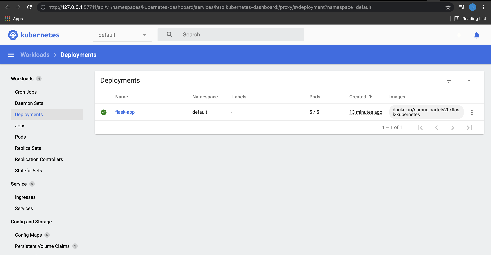
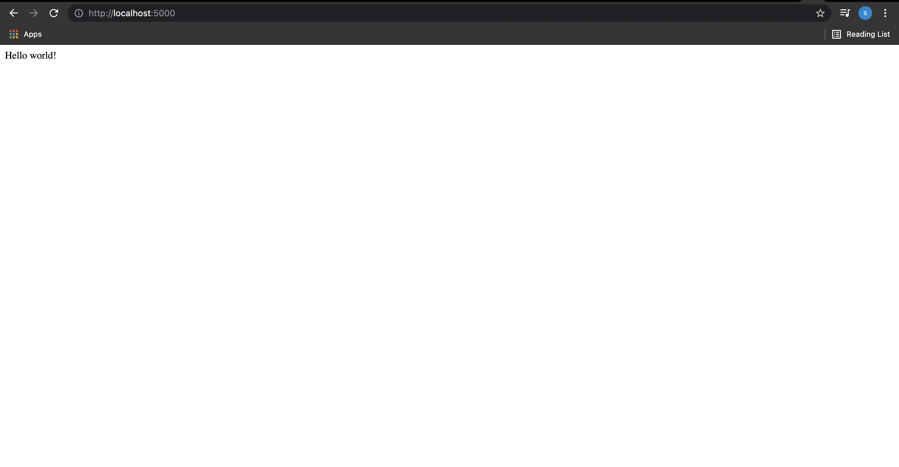

# flask-app

## What we want to do
- Dockerize your application
- Build the docker image

```
docker build -t [name of image] .
```
- Start a single node Kubernetes cluster on your machine

```
minikube dashboard
```

- Push your dockerized application into Kubernetes

```
kubectl apply -f service.yaml
```
- Define a service (service.yaml) for your application
- The application should be accessible via localhost and display a text of your choice in a Browser

## result

Flask app running on Kubernetes


Flask app running on localhost port 5000



